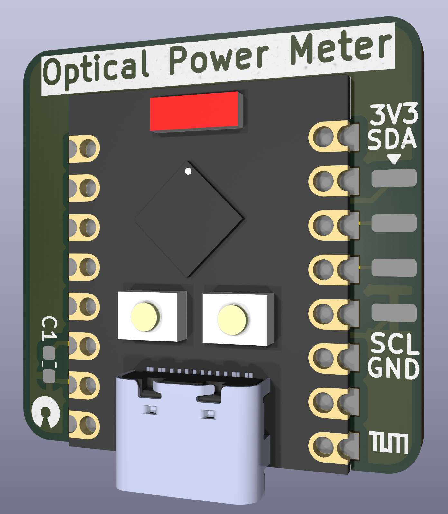
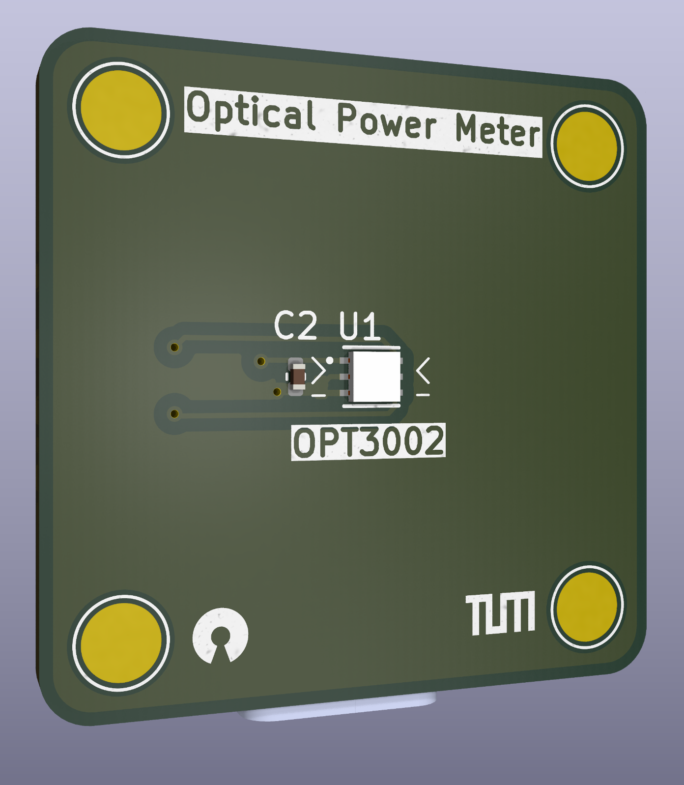

# OPT3002 Irradiance Sensor for mSLA Printers

    
    
    

**A custom UV irradiance measurement solution for resin 3D printer calibration**

## Overview

This custom irradiance sensor uses the Texas Instruments OPT3002 light sensor coupled with an ESP32-S3 SuperMini microcontroller to provide accurate UV light measurements for mSLA 3D printers.
These measurements are essential for proper exposure calibration across different printers without recalibrating the resin model parameters.

## Sensor Specifications

The OPT3002 sensor features:
- 23-bit effective dynamic range with automatic gain scaling
- Wavelength response from 300nm to 1000nm
- Spectral response at 390-410nm (typical for mSLA printers) is approximately 0.68 relative to the reference wavelength of 505nm
- Wide measurement range from 1.8 nW/cm² to 4 mW/cm²
- I²C interface for communication

## Hardware Design

The custom breakout board is designed specifically for mSLA printer measurement:

- **Front side**: Contains only the sensor and four solder pads (add solder to them to add some defined points of contact)
- **Back side**: Houses the ESP32-S3 SuperMini and i2c breakout, so the sensor can also be used with other microcontrollers
- **Solder spacers**: Ensure the PCB sits flat on the printer screen with the sensor nearly in contact with the FEP film

## Firmware

The Arduino firmware in the `firmware` directory configures the OPT3002 sensor for:

- Automatic range scaling
- 800ms integration time for low-noise measurements
- Continuous conversion mode
- Output rate of 1Hz via serial interface

### ESP32-S3 SuperMini Setup

1. **Prerequisites**:
   - Arduino IDE with ESP32 board support installed
   - [ClosedCube_OPT3002 library](https://github.com/closedcube/ClosedCube_OPT3002_Arduino)

2. **Enable USB CDC on First Upload**:

   Important: Before first upload, hold the BOOT button while connecting the ESP32-S3.

   In Arduino IDE, select Tools > USB CDC On Boot > Enabled

3. **Upload Instructions**:
   - Select `ESP32S3 Supermini` as the board
   - Set USB CDC On Boot: Enabled
   - Press and hold the BOOT button (only needed for the first upload)
   - Connect the ESP32-S3 SuperMini via USB-C
   - Release the BOOT button after connection
   - Upload the sketch from Arduino IDE

## Usage Instructions

1. Place the sensor directly on the printer screen (with the FEP film in place)
2. Connect the ESP32-S3 SuperMini to your computer via USB-C
3. Open Arduino Serial Monitor (9600 baud)
4. The sensor will output readings in μW/cm² at 1Hz
5. Take multiple measurements at different screen positions for accurate calibration

## Measurement Interpretation

The OPT3002 outputs irradiance values in μW/cm², but these need correction for UV wavelengths:

1. Record the measured irradiance value
2. Apply spectral response correction: `Actual Irradiance = Measured Irradiance ÷ 0.68`
3. Use this corrected value as $I_0$ in exposure calculations

For example, a measurement of 1318.0 μW/cm² would translate to an effective $I_0$ of 1938.24 μW/cm² at 400nm.

## Calibration Process

For best results:

1. Take measurements at multiple positions across the print area
2. Record 5-6 readings at each position
3. Calculate the mean irradiance value
4. Apply the spectral correction factor (÷ 0.68)
5. Use this value in the OpenSLAice physical exposure model

## Further Reading

For more information about the physical model and how these measurements are used in exposure calculations, please refer to the main OpenSLAice documentation.
